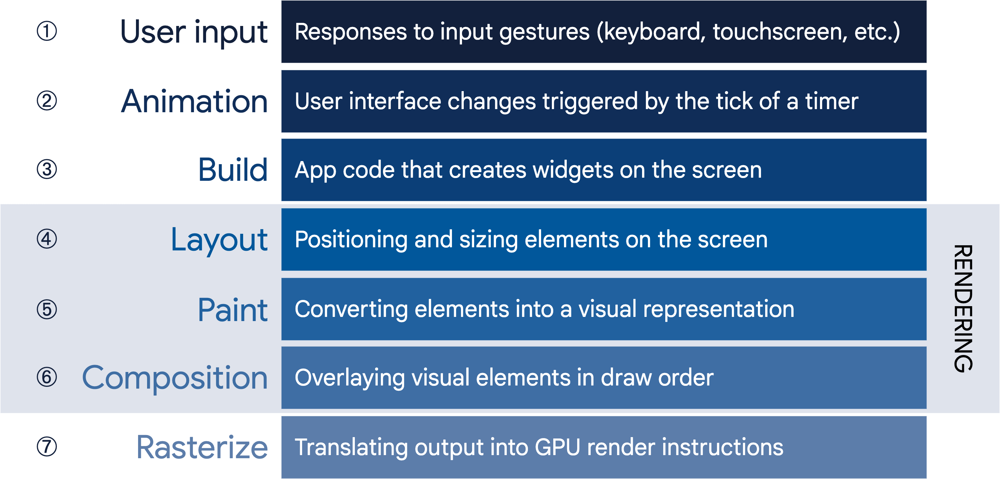

## What I Learned

#

#### [Q1] 왜 별다른 코드를 안적었음에도 자동으로 텍스트필드 위치가 키보드 높이를 반영하는걸까?

#### [A1] Scaffold의 기본 동작때문이다.
- Scaffold는 화면 레이아웃을 구성할 때, 화면의 가용 영역을 관리한다. 
- 키보드가 올라오면 Scaffold는 남은 화면 크기를 재계산하고, 그에 맞춰 자식 위젯을 다시 배치한다. 
- 즉, 키보드가 나타나면서 화면의 높이가 줄어들게 되고, Scaffold가 이 변경 사항을 감지하여 자동으로 UI를 조정해준다.
- 만약 키보드가 올라와도 특정 요소가 움직이지 않도록 하고 싶다면, `resizeToAvoidBottomInset: false` 옵션을 Scaffold에 추가할 수 있다.

 

#

#### [Q2] 그러면 Scaffold는 키보드가 올라올때마다 위젯트리를 다시 그리는걸까?

#### [A2]  Scaffold가 위젯 트리를 다시 그리는(rebuild) 것은 아니다.

- 대신, Scaffold는 레이아웃을 조정하여 가용한 화면 공간에 맞게 자식 위젯의 배치를 다시 계산한다. 
- 키보드가 올라오면 Scaffold는 화면의 가용 영역이 변경되었다고 감지하고, 이 변경 사항에 따라 자식 위젯들의 배치를 다시 계산한다. 
- 하지만 Flutter는 전체 위젯 트리를 다시 그리지 않고, 필요한 부분만 다시 배치하거나 다시 그리게 된다. 
- 즉 build 단계를 재호출하는 것이 아닌 repaint 또는 layout 단계를 호출한다. 
- 따라서 성능적으로 효율적인 ui를 그리게 된다.

 

#

#### [Q3] 그러면 내부적으로 Scaffold는  화면 너비/높이를 옵저빙하고 있다는건데 MediaQuery가 필요없는거아니야?
#### [A3] Scaffold는 키보드와 같은 시스템 UI 변화에 대한 자동 레이아웃 조정 기능을 제공하지만, 화면의 구체적인 크기나 패딩 정보가 필요할 때는 MediaQuery를 써야한다.
- Scaffold는 화면의 크기를 알고 있지만, 그 크기를 명시적으로 클라이언트(Flutter 개발자)에게 제공하지는 않는다. 
- 즉, Scaffold는 화면의 크기나 키보드가 올라오는 등의 변화에 따라 UI가 어떻게 배치되어야 하는지 알고 있지만, 개발자에게 그 정보를 주기 위한 도구가 아니다.

 

#
